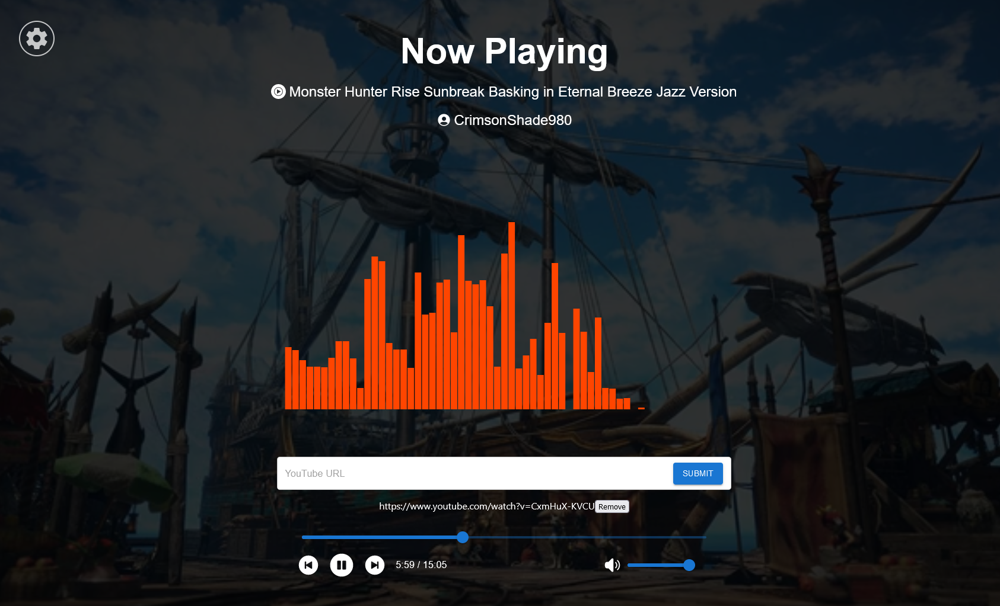
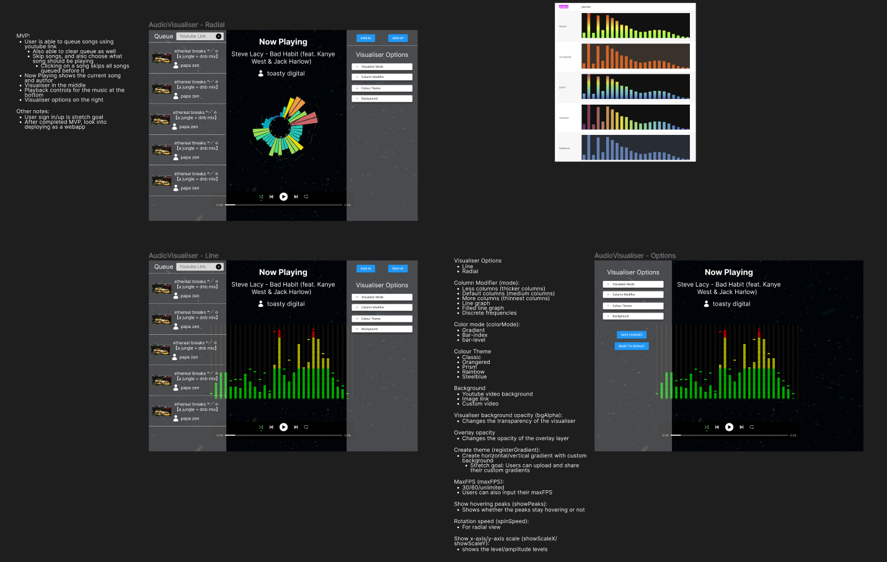

# Audio Visualiser

This is a personal project of mine to allow users to visualise the audio from YouTube videos. It uses React for the frontend to display the visualiser and Firebase for the backend to provide a real-time database.

## MVP Goals

* Users are able to input YouTube URLs and see the frequencies displayed through a visualiser.
* Users are able to queue multiple videos and experience typical queue functionality (re-arranging order, directly skipping to a particular video)
* Users are able to customise the visualiser through various options and presets.

## Stretch Goals/Future Plans

* Users will be able to create custom settings and save them as presets, stored either locally through localstorage, a custom .json settings that is exported or by logging in/signing up for an account.
* Multiple users will be able to join a session and queue videos, control playback and change visualiser options. Users are able to join as a guest or log into their account.
* Rewrite the latest version of the Youtube to HTML5 library to work with React (currently, only legacy versions seem to support React) and self-host the API middle-man service in case current services are shutdown.  

## WIP Screenshots!

